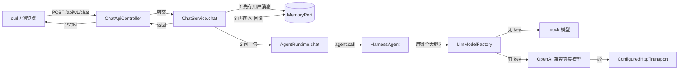

# 代码学习导览（陪你读懂 OpenAlice 的代码）

> 这份文档是**地图 + 教材 + 练习册**，不是代码百科全书。
> 目标：让你能合上文档，把「一次 `你好` 从 HTTP 到 AI 回复再到记忆」讲清楚，并且敢动手改代码。
> 用法：先读 §1 学习方法 → §2/§3 看地图 → §4 跟着主线走一遍 → §5 看最近一次大改动 → 用 §7/§8 自测与练习。

| 项目 | 内容 |
| :-- | :-- |
| 版本 | v0.2 |
| 日期 | 2026-09-07 |
| 配套代码 | 单模块收敛重构后（四模块 → 单模块 + service 编排层；本地未推送） |
| 读者 | 项目唯一开发者本人（边做边学） |
| 配套文档 | `docs/index.md`（索引）、`docs/CONTEXT.md`（术语）、`handoff.md`（交接） |

---

## 0. 先回答三个问题（自检，答案在文末对应小节）

1. 一次「你好」从 `curl` 发出到收到回复，经过了哪几层？（§4.9）
2. 为什么**不配置任何 key** 也能回复「收到：你好」？（§5.7）
3. 想把 AI 的默认人设改成「你叫爱丽丝，说话简短」，应该改哪个文件？（§5.7，注意有个陷阱）

答不出来不丢人——这份文档就是为此写的。读完再回来答一次。

---

## 1. 怎么学 AI 写的代码（调研结论 + 本仓库约定）

> 你要求的「去网上找帮人理解 AI 代码的流程/工具」，结论先放这里：**没有银弹工具，但有几套被反复验证的流程**。本仓库按它们落地成 §1.2 的三条约定。

### 1.1 网上值得借鉴的方法

| 来源 | 核心方法 | 我们怎么用 |
| :-- | :-- | :-- |
| [GitHub 工程师如何学新代码库](https://github.blog/developer-skills/application-development/how-github-engineers-learn-new-codebases/) | 跑起来 → 找入口 → **挑一条真实请求追到底**（跨各层）→ 写测试验证理解 → **故意改坏看失败模式**；产出技术地图与命令速查 | §4 就是「一条 `POST /chat` 追到底」；§7 让你亲手改坏一个测试 |
| [Codojo（代码道场）](https://github.com/ttguy0707/codojo) | 扫描 → 能力评估 → 制定计划 → **教学（理论 → 你回「理解」→ 小改动实践 → 回「完成」）** → 独立魔改；学习状态沉淀成文件，可跨会话续学 | §8 追踪表承担「能力评估 + 续学」；每次讲解都要求你回讲 |
| [AntiVibe](https://github.com/mohi-devhub/antivibe) | 讲代码要讲清 **What（做什么）/ Why（为什么这么写）/ When（何时用）/ Alternatives（别的做法）**；按 junior/mid/senior 调深浅 | 以后我讲解代码默认按这套四问来，你可随时说「讲浅一点 / 讲深一点」 |
| [Claude Code 学习指南（UVAL 协议）](https://github.com/FlorianBruniaux/claude-code-ultimate-guide/blob/main/guide/learning-with-ai.md) | **U**nderstand First（先自己复述问题、想 3 个方案、列知识缺口，再问 AI）→ **V**erify（用自己的话讲回去）→ **A**pply（**绝不直接抄，至少亲手改一处**）→ **L**earn（每次只记一条「学到的东西 + 上下文 + 给未来的自己」） | §1.2 约定 2/3 就是 Verify + Apply；「一句话学习日志」见 §8 |
| 反面教材：**vibe coding 陷阱** | 全盘接受 AI 输出、不看 diff、坏了乱试；[有随机对照实验](https://arxiv.org/abs/2601.20245) 显示纯依赖 AI 学新库，技能习得反而降 ~17% | 所以本仓库强制「回讲 + 动手改」，抵消「只接受不理解」 |

一句话总结：**AI 写代码给你看 → 你用自己的话讲一遍 → 亲手改一处跑通 → 记一条笔记**。顺序不能反。

### 1.2 在本仓库立下的三条学习约定

1. **我讲给你听**：我交付/讲解代码时，先说「它解决什么问题 → 为什么这么设计 → 对应哪个文件」，再给细节，控制术语密度。
2. **你回讲给我听**：看完一段代码，你用自己的话复述一遍；讲不清的地方就是下一步要学的地方（用 §8 记下来）。
3. **你亲手改一处**：任何新代码，你至少要亲手改动并跑通一次（哪怕只是改人设文案或回复前缀），禁止只看不改。

> 这三条会写进 `handoff.md`，让之后的每次会话都延续。

---

## 2. 项目全景：先看地图，再上路

### 2.1 三个词读懂这套架构（单模块版）

| 词 | 本仓库对应包 | 人话解释 |
| :-- | :-- | :-- |
| **模型 / 端口** | `model/` + `port/` | 「聊天消息长什么样」「记忆要有哪两个能力」——只定义**规则和接口**，不干活 |
| **适配器** | `memory/` | 「记忆接口」的**具体实现**（内存版，将来换 PostgreSQL 版，接口不变） |
| **编排（service）** | `service/` | 一次聊天**先做什么、后做什么**的总指挥（本次重构新增） |
| **组合根** | `config/` + 启动类 | 全项目**唯一**知道「用哪个记忆实现、用哪个模型」的地方，负责把所有零件插好 |

一句话：`model/port` 画插座 → `memory` / `agent` 造插头 → `service` 指挥插拔顺序 → Spring（组合根）通电开机。谁都不越权。

### 2.2 包与依赖（一个 Maven 工程，靠「包」分层）

```text
src/main/java/openalice/
├── OpenAliceApplication.java   # 启动类（@SpringBootApplication，组合根 = Spring 容器）
├── model/      聊天消息 / 用户 / 会话 的纯数据结构（不依赖 Spring / AgentScope）
├── port/       接口：MemoryPort（「存记忆」这件事的抽象 = dao 层接口）
├── memory/     接口的内存实现（以后换 PostgreSQL，只动这里 + config 一行）
├── agent/      AgentScope 运行时：runtime/（执行器）+ llm/（模型接入）
├── service/    ★ ChatService：一次 /chat 的业务编排
├── controller/ HTTP 入口（翻译官）
├── dto/        HTTP 出入参对象
└── config/     Spring 组合根（组装 memory + agent）
```

依赖方向（只能往箭头方向依赖，防止乱成一团）：

```text
model ← port ← memory        （memory 认识接口，不认识上层）
model ← agent                （agent 只问模型，不碰存储实现）
service → model + port + agent（编排者认识所有零件）
controller → service         （controller 只认识一个门面）
config 组装 memory + agent    （组合根认识所有实现）
```

规则背后的意图：**`agent` 不认识 `memory` 的实现**，只认识 `port.MemoryPort` 接口。以后把内存记忆换成数据库记忆，`agent` 和 `service` 一行都不用改——只动 `config` 那一行。

### 2.3 每个包读什么（★ = 本阶段必读）

| 包 | 关键文件（仓库相对路径） | 作用 | 优先级 |
| :-- | :-- | :-- | :-- |
| model | `src/main/java/openalice/model/ChatMessage.java` | 一条聊天消息（谁说的、说了啥、何时） | ★ |
| model | `.../model/UserId.java` `SessionId.java` | 用户/会话 ID，带「不能为空」校验 | ★ |
| port | `.../port/MemoryPort.java` | **记忆接口**：只有 append / history 两个方法 | ★★ |
| memory | `.../memory/InMemoryMemoryPort.java` | 记忆的内存实现（P1 过渡） | ★★ |
| service | `.../service/ChatService.java` | **★ 本次重构新增**：编排「存你的话 → 问 agent → 存回复」 | ★★★ |
| agent | `.../agent/runtime/AgentRuntime.java` | agent 接口：只暴露 `chat(ChatMessage)` | ★ |
| agent | `.../agent/runtime/AgentScopeAgentRuntime.java` | AgentScope 实现：只做「问一次模型」，不管存储 | ★★ |
| agent | `.../agent/runtime/AgentRuntimeProperties.java` | 运行配置：读 `OPENALICE_*` 环境变量 | ★★★ |
| agent | `.../agent/llm/LlmProvider.java` | 模型来源枚举（mock / deepseek / 中转站） | ★★ |
| agent | `.../agent/llm/LlmModelFactory.java` | **选哪个模型的大脑**：auto 回退逻辑在这 | ★★★ |
| agent | `.../agent/llm/ConfiguredHttpTransport.java` | 网络层：代理 + 中转站需要的特殊请求头 | ★ |
| controller | `.../controller/ChatApiController.java` | HTTP 入口：只做翻译，转给 ChatService | ★★ |
| config | `.../config/OpenAliceConfiguration.java` | **组合根**：组装记忆与 agent（原 CompositionConfiguration） | ★★ |
| controller | `.../controller/ApiExceptionHandler.java` | 参数错误统一转 HTTP 400 | ★ |

---

## 3. 一张图看懂调用关系



读图顺序（也是 §4 的讲解顺序）：**入口 → 编排 → 组合根 → 运行时 → 模型 → 记忆 → 出口**。

---

## 4. 主线：一次 `POST /api/v1/chat` 的完整旅程

> 本节是全文最重要的部分。跟着每一小节，在 IntelliJ 里用 `⌘B`（跳到定义）/ `⌥F7`（找谁在用它）亲手点一遍。
> 改造后最值得先看的是 4.2（新增的编排层）和 4.4（被瘦身的 runtime）。

### 4.1 HTTP 层：`ChatApiController`（入口翻译官）

```java
@RestController
@RequestMapping("/api/v1")
public class ChatApiController {
    @PostMapping("/chat")
    ChatReply chat(@RequestBody ChatRequest request) {
        return chatService.chat(request);   // 自己一行业务都不写，直接转给 service
    }

    @GetMapping("/users/{userId}/sessions/{sessionId}/messages")
    List<MessageView> history(@PathVariable String userId, @PathVariable String sessionId) {
        return chatService.history(userId, sessionId);
    }
}
```

看懂要点：
- Controller 只做**翻译**（HTTP ↔ 方法调用），不写业务；
- 它只依赖一个对象：`ChatService`。这是本次重构学 Jarvis 的最大变化——原来 controller 同时认识 `AgentRuntime` 和 `MemoryPort` 两个接口，现在被收口到 **service 一个门面**（看构造器只有 `ChatService` 一个参数）。

### 4.2 编排层：`ChatService.chat()`（★ 本次重构新增——原来这五步揉在 runtime 里）

```java
@Service
public class ChatService {
    public ChatReply chat(ChatRequest request) {
        // 1) 校验 message 非空
        // 2) 字符串 → 值对象：UserId.of / SessionId.of（自带「不能为空」校验）
        // 3) 构造用户消息并「先存」：memoryPort.append(userMessage)
        // 4) 让 agent 只回答一次：agentRuntime.chat(userMessage)
        // 5) 把助手回复也「后存」：memoryPort.append(ChatMessage.assistant(...))
        // 6) 包装成 ChatReply 返回
    }
}
```

看懂要点：**「先存你说的话 → 让 AI 回答 → 把回答也存起来」这整套顺序现在归 service 管**。runtime 不再碰记忆；将来记忆从内存换数据库时，service 一行不用改（它只认识 `MemoryPort` 接口，不认识 `InMemoryMemoryPort`）。

### 4.3 组合根：`OpenAliceConfiguration`（Spring 装配，原 `CompositionConfiguration` 改名移包）

```java
@Configuration
public class OpenAliceConfiguration {
    @Bean MemoryPort memoryPort() { return new InMemoryMemoryPort(); }

    @Bean(destroyMethod = "close")
    AgentRuntime agentRuntime() {
        return AgentRuntimeFactory.create(AgentRuntimeProperties.fromEnvironment());  // 读环境变量
    }
}
```

看懂要点：
- Spring 启动时执行这里，创建好两个 Bean，并注入到需要的地方（4.2 的 `ChatService` 靠构造器拿到它们）；
- **想换数据库记忆时，只改 `memoryPort()` 方法体**（换成 PG 实现），别的地方不用动——这就是「组合根」的价值；
- `AgentRuntimeProperties.fromEnvironment()`：把 `OPENALICE_*` 环境变量读成配置（§5 详解）；
- `AgentRuntimeFactory.create(...)` 是 agent 域的构造入口，帮你藏住 `AgentScopeAgentRuntime` 这个实现类。

### 4.4 运行时层：`AgentScopeAgentRuntime.chat()`（瘦身后：只问一次，不管存储）

```java
public ChatResult chat(ChatMessage userMessage) {
    // 1) 校验：只接受 USER 角色消息
    // 2) 组装 AgentScope 的 RuntimeContext（带 userId/sessionId，用于状态隔离）
    RuntimeContext context = RuntimeContext.builder()...build();

    // 3) 真正调用模型（异步，最多等 timeout=60 秒）
    Msg response = agent.call(userMessage.content(), context).block(timeout);

    // 4) 取回复文本返回；「存消息」在 4.2 的 service 里做
    return new ChatResult(userMessage.userId(), userMessage.sessionId(), response.getTextContent());
}
```

看懂要点：runtime 从「五步走」瘦成「只回答」。**谁负责编排、谁负责执行，从此分开**——这正是参考项目（如 nanobot 的 Loop 层 vs Runner 层）里的经典分工：`ChatService` = Loop（编排），`AgentRuntime` = Runner（执行）。

### 4.5 AgentScope 层：构造 `HarnessAgent` 的那 20 行

`HarnessAgent` 是 AgentScope 提供的「带运行环境的智能体」。但 P1 阶段我们把它**刻意削成只会聊天**：

```text
.name / .description / .sysPrompt   → 名字、简介、人设（当前人设来自 properties）
.model(...)                          → 大脑（4.6 决定它是 mock 还是真实模型）
.stateStore(InMemoryAgentStateStore) → 会话状态放内存
.maxIters(1)                         → 只让模型答一步，不允许它反复调工具
.disableFilesystemTools()            ┐
.disableShellTool()                  │ 关掉文件 / Shell / 记忆 / 子 agent /
.disableMemoryTools()                │ 技能等一切「手脚」
...                                  ┘ 现在它只是「会说话，没手脚」
```

看懂要点：AgentScope 默认给的 agent 很「重」（能碰文件、能执行命令、能开子 agent）。我们把不需要的能力**逐个关掉**，得到一个可控的纯聊天最小体。将来 P2/P3 要加记忆、语音能力时，就是**按需把某个 disable 去掉**，而不是另起炉灶。

### 4.6 模型层：`agent/llm/`（大脑在哪，详见 §5）

- `LlmModelFactory`：**选哪个模型**的工厂，auto 回退链在这（§5.3）；
- `DeterministicChatModel`（mock）与真实模型都实现 AgentScope 的 `Model` 接口；
- 对 `HarnessAgent` 来说它们**长得一样**，所以切换 provider 不需要改 agent 逻辑；
- 包名备注：原 `agent/model` 与顶层 `model` 撞名易混，重构后并入 `agent/llm`。

### 4.7 记忆层：`MemoryPort` 接口 + `InMemoryMemoryPort` 实现

接口（port 包，就是未来 dao 的抽象）：

```java
public interface MemoryPort {
    void append(ChatMessage message);                            // 写一条
    List<ChatMessage> history(UserId u, SessionId s, int limit); // 读最近 limit 条
}
```

内存实现（memory 包）的三个小技巧：

| 代码 | 为什么 |
| :-- | :-- |
| `Map<SessionKey, List<ChatMessage>>`（ConcurrentHashMap） | 按「用户+会话」隔离，天然支持多会话并行 |
| `synchronized (messages)` 再写入 | 同一会话并发写入不丢消息（测试里压了 128 次并发） |
| `List.copyOf(...)` 返回副本 | 调用方拿到的是「快照」，改它不会弄坏内部数据 |

### 4.8 出口与错误处理

- 正常返回：`ChatReply` record → Spring/Jackson 自动转 JSON；
- 参数错误：抛 `IllegalArgumentException` → `ApiExceptionHandler`（`@RestControllerAdvice`）统一转成 HTTP 400 + `{"error": "..."}`；
- 访问 `http://localhost:8080/` 看到 **Whitelabel 404**：正常！本项目是纯 API 后端，没有网页前端。可用端点只有：
  - `GET /actuator/health`（健康检查）
  - `POST /api/v1/chat`（聊天）
  - `GET /api/v1/users/{u}/sessions/{s}/messages`（历史）

### 4.9 链路回顾 + 问题 1 答案

完整链条：**curl → ChatApiController（翻译）→ ChatService（编排：先存 user → 问 agent → 再存 assistant）→ AgentRuntime（瘦身执行器）→ HarnessAgent → LlmModelFactory 选模型 → 模型返回 → 回复写进 MemoryPort → 返回 JSON**。

> ✅ **Q1 答案**：经历了 5 个角色——HTTP 入口层（controller）→ 业务编排层（service，本次新增）→ 运行时层（agent/runtime）→ 模型层（agent/llm）→ 记忆层（port + memory），外加 config 组合根负责装配。

---

## 5. 专题：真实 LLM 双 provider 是怎么接进去的（最近一次大改动）

### 5.0 背景

想让 AI「说真话」，就要接一个真实模型。项目有两个渠道：
1. **中转站（AgentRouter，优先）**：OpenAI 兼容接口，但网关有 WAF，只放行「长得像 Codex 官方客户端」的请求；
2. **DeepSeek 官方 API（兜底）**：直连官方。

红线：**API key 绝不写进代码/配置文件**，只从环境变量现读现用。

### 5.1 配置对象：`AgentRuntimeProperties`（一个 Java `record`）

- record = 「只有数据」的类型。构造时自动做归一化（空值填默认、去空格）；
- 类里定义了 6 个 `OPENALICE_*` 环境变量名常量；
- `fromEnvironment()`：把环境变量读进来。**注意：key 不在这里**，这里只放 provider / model / baseUrl / proxy。

### 5.2 枚举：`LlmProvider`

枚举 = 固定取值集合。每个取值自带 3 个「随身数据」：

```text
MOCK        (无默认地址,     模型=null,         无 key)
DEEPSEEK    (api.deepseek.com, deepseek-v4-flash, OPENALICE_DEEPSEEK_API_KEY)
AGENTROUTER (agentrouter.org,  deepseek-v4-flash, OPENALICE_AGENTROUTER_API_KEY)
AUTO        (无, 无, 无)  ← 默认值
```

`parse()` 把字符串（如 `"deepseek"`）翻译成枚举，`null`/空白 = `AUTO`，不认识的值直接抛异常。

### 5.3 大脑：`LlmModelFactory`（auto 回退链在这）

```text
resolve(配置):
  如果显式指定了 provider（如 OPENALICE_LLM_PROVIDER=deepseek）→ 用它
  否则 AUTO 模式，按顺序探测：
     ① 有 AGENTROUTER key?  → 用中转站
     ② 有 DEEPSEEK key?     → 用官方
     ③ 都没有              → 用 mock（回复「收到：…」）
```

构造真实模型时：key 从环境变量**现读**（`System.getenv`）；baseUrl / model 用「环境变量覆盖值优先，否则 provider 自带默认」；`stream(true)` 开流式；网络层塞进 `ConfiguredHttpTransport`。

### 5.4 网络层：`ConfiguredHttpTransport`

两个职责：
1. **可选代理**：`OPENALICE_LLM_PROXY=127.0.0.1:7897` 时走本地代理（中转站有时需要）；
2. **注入 Codex 指纹头**：中转站 WAF 只放行「官方 Codex 客户端」样子的请求，而普通 SDK 只带 `Authorization` 等头会被拒（401）。这个类给请求补上 `Originator / User-Agent / Version` 三个头，让中转站放行。

它实现了 AgentScope 的 `HttpTransport` 接口，所以能**无缝塞给 `OpenAIChatModel`**——这就是「适配器」的又一次体现。

### 5.5 从环境变量到模型的数据流

```text
shell 里 export OPENALICE_AGENTROUTER_API_KEY=xxx
        │
        ▼
AgentRuntimeProperties.fromEnvironment()   ← 读 OPENALICE_LLM_PROVIDER/MODEL/BASE_URL/PROXY
        │
        ▼
LlmModelFactory.resolve()                  ← 显式 provider？否则 auto 按 key 探测
        │
        ▼
openAiChatModel()                          ← key 从 System.getenv 现读，绝不落盘
        │
        ▼
OpenAIChatModel(stream=true) + ConfiguredHttpTransport(代理? 指纹头?)
        │
        ▼
HarnessAgent.model                        ← agent 不关心背后是谁
```

### 5.6 动手实验（每个都跑一遍，感受变化）

```bash
# 实验 1：什么都不配 → 走 mock
mvn spring-boot:run
curl -X POST http://localhost:8080/api/v1/chat -H 'Content-Type: application/json' \
  -d '{"userId":"user","sessionId":"default","message":"你好"}'     # → "收到：你好"

# 实验 2：只配 DeepSeek 官方 key → 走官方真实模型
OPENALICE_LLM_PROVIDER=deepseek \
OPENALICE_DEEPSEEK_API_KEY=<你的key> \
mvn spring-boot:run

# 实验 3：配中转站 + 代理（如需要）→ 走中转站
OPENALICE_LLM_PROVIDER=agentrouter \
OPENALICE_AGENTROUTER_API_KEY=<你的key> \
OPENALICE_LLM_PROXY=127.0.0.1:7897 \
mvn spring-boot:run

# 实验 4（故意改坏）：OPENALICE_LLM_PROVIDER=oops → 启动即报错，看 LlmProvider.parse 的报错文案
```

> 注意：两个 key 请只放环境变量里，别写进任何文件；换电脑/换终端就重新 export。

### 5.7 问题 2 / 问题 3 答案（含陷阱）

> ✅ **Q2 答案**：`LlmModelFactory.resolve()` 的 auto 回退链——没有 AGENTROUTER key、没有 DEEPSEEK key，就落到 `MOCK`，用 `DeterministicChatModel` 回复「收到：+你的话」，所以全链路无 key 也能跑通（测试也靠它）。

> ✅ **Q3 答案（陷阱预警）**：想改 AI 人设，正确位置是 `agent/runtime/AgentRuntimeProperties.java` 的 **`systemPrompt` 字段**（默认 `"You are Alice, a warm and attentive AI companion."`）。
> 陷阱来源：旧代码里曾有一个 `persona/PersonaPrompt.java` 占位类，**0 处引用、改了不生效**，专门误导人——单模块重构时已把它删掉（见 ADR 08）。以后若做 `persona/` 首启初始化（参考 OpenHanako 的用户引导），再按需重建，不要提前留死代码。

---

## 6. 记忆现在怎么存（P1 过渡实现）

| 问题 | 现状 | 未来（P1 目标 / P2） |
| :-- | :-- | :-- |
| 存哪 | `InMemoryMemoryPort`（进程内存） | PostgreSQL `session_message` 表（重启不丢） |
| 接口变不变 | `MemoryPort` 不变 | 不变 → agent / service 无感知 |
| 谁换 | 只改组合根 `config/OpenAliceConfiguration` 的 `memoryPort()` | 同左 |
| 长期记忆 | 无（只存当前会话消息） | M2 结构化 / M3 语义（见《记忆架构设计 v0.4》） |

**读代码记住一句**：现在这个「记忆」只是把每轮对话按会话堆在内存里；`MemoryPort` 这个接口是将来升级的「换接口不换插座」的关键。

---

## 7. 测试在教我们什么（读测试 = 快速理解代码意图）

| 测试文件 | 它在验证什么 | 教给你的意图 |
| :-- | :-- | :-- |
| `src/test/java/openalice/model/ChatMessageTest` | 消息能建、空 ID 拒绝 | 领域对象自带校验 |
| `src/test/java/openalice/memory/InMemoryMemoryPortTest` | 会话隔离 / 只取尾巴 N 条且不可变 / 128 次并发不丢 | 这个内存实现最重要的三个承诺 |
| `src/test/java/openalice/service/ChatServiceTest` | **★ 重构后新增**：编排顺序 = 先存 user → 回复 → 再存 assistant | service 是「总指挥」，测试直接验证它 |
| `src/test/java/openalice/agent/runtime/AgentScopeAgentRuntimeTest` | 默认 mock 模型能回「收到：…」；两个会话并发互不串 | runtime 现在只负责「回答」，不再管存储 |
| `src/test/java/openalice/controller/ChatApiControllerTest` | 不真开端口，用 MockMvc 打完整链路 | Controller 的翻译职责 + 参数校验 |

**练习（Apply）**：把 `ChatService.chat()` 里的 `memoryPort.append(userMessage)` 那行注释掉 → 跑 `mvn test` → 看哪个测试变红（`ChatServiceTest` 必红）→ 想明白为什么 → 改回来。这就是 GitHub 工程师说的「故意改坏，理解失败模式」。

---

## 8. 学习追踪表（每次会话更新）

> 状态：✅ 能用自己的话讲清 ｜ 🟡 半懂 ｜ ❌ 卡住。卡住的地方就是下次提问的清单。

| 主题 | 对应小节/文件 | 状态 | 日期 | 我的一句话笔记（学到的 ONE thing） |
| :-- | :-- | :-- | :-- | :-- |
| record / enum / interface 是什么 | §4.1/§5.2 | | | |
| Controller 只认 ChatService 一个门面 | §4.1 | | | |
| service 编排：为什么「先存后答」归它管 | §4.2 | | | |
| 组合根为什么只改一行就换存储 | §4.3 | | | |
| runtime 瘦身：编排与执行分开 | §4.4 | | | |
| HarnessAgent 为什么被削成纯聊天 | §4.5 | | | |
| auto 回退链（中转→官方→mock） | §5.3 | | | |
| 为什么中转站要「指纹头」 | §5.4 | | | |
| 改人设该改哪里（别再找 PersonaPrompt） | §5.7 | | | |
| MemoryPort 换实现不动 agent / service | §6 | | | |
| 怎么把代码改坏让测试变红 | §7 | | | |
| （本次重构）单模块各包与四模块的对应 | §2.1/ADR 08 | | | |

---

## 9. 常用命令速查

```bash
mvn clean test                                # 全部测试（最快了解是否改坏的方式）
mvn package                                   # 打包可执行 jar
mvn spring-boot:run                           # 启动（默认 8080）
curl http://localhost:8080/actuator/health    # 健康检查
curl -X POST http://localhost:8080/api/v1/chat \
  -H 'Content-Type: application/json' \
  -d '{"userId":"user","sessionId":"default","message":"你好"}'   # 聊天
curl http://localhost:8080/api/v1/users/user/sessions/default/messages  # 看历史
```

IntelliJ 跳转练习路线（⌘B 进定义，⌥F7 找使用）：

```text
ChatApiController.chat
  └─ ⌘B chatService.chat          → ChatService.chat（§4.2 编排）
       ├─ ⌘B memoryPort.append    → MemoryPort 接口（§4.7）→ 实现 InMemoryMemoryPort
       └─ ⌘B agentRuntime.chat    → AgentRuntime 接口
            └─ ⌘B 实现            → AgentScopeAgentRuntime.chat（§4.4 只回答）
                 └─ ⌘B agent.call → HarnessAgent（§4.5）
```

---

## 10. 维护规则（给未来的 Codex / 协作者）

本文件是**活的**，随代码演进。约定如下：

1. **必须更新的时机**：任何下列变化落地后，本次会话内同步更新本文件——
   - 包增删、`MemoryPort`/`AgentRuntime`/`ChatService` 等接口变化（§2.2/§4.7/§6）；
   - 新增/替换模型 provider 或网络层（§5）；
   - 新增 HTTP 端点或改协议（§4）；
   - `/chat` 改 SSE 流式、M1 落 PG、persona 初始化上线（届时更新 §4/§6 并给新专题小节）；
2. **版本与变更记录**：结构性更新 bump 版本号（v0.1 → v0.2 …），并在文末「变更记录」加一行（日期 / 配套 commit / 改了什么）；只追加、不改写历史结论。
3. **配套同步**：同步更新 `docs/index.md` 的概括与 `handoff.md`（交接时提醒「代码学习导览需随代码维护」）。
4. **讲解风格红线**：面向学习中的唯一开发者——讲 What/Why/对应文件，少贴大段源码；标注「必读/选读」；发现类似曾被删除的 `PersonaPrompt` 那种未接线死代码要显式提示，不要默默忽略。

## 变更记录

| 版本 | 日期 | 配套 commit | 变更 |
| :-- | :-- | :-- | :-- |
| v0.1 | 2026-09-07 | `7f1b4dd` | 初版：全景地图 + `POST /chat` 主线链路 + 双 provider 专题 + 学习追踪表 |
| v0.2 | 2026-09-07 | 单模块收敛（本地未推送） | 四模块 → 单模块：新增 §4.2 编排层（ChatService）、runtime 瘦身说明；全部路径改为 `src/main/java/openalice/...`；`agent/config|model` 并入 `runtime|llm`；PersonaPrompt 陷阱更新（已删除） |
