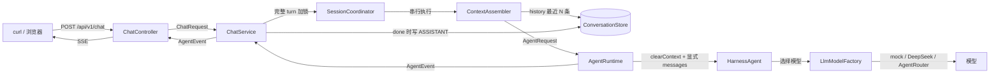

# 代码学习导览（陪你读懂 OpenAlice 的代码）

> 这份文档是**地图 + 教材 + 练习册**，不是代码百科全书。
> 目标：让你能合上文档，把「一次 `你好` 从 HTTP 到 AI 回复再到记忆」讲清楚，并且敢动手改代码。
> 用法：先读 §1 学习方法 → §2/§3 看地图 → §4 跟着主线走一遍 → §5 看 provider 专题 → §7/§8 自测与练习。

| 项目 | 内容 |
| :--- | :--- |
| 版本 | v0.5 |
| 日期 | 2026-09-08 |
| 配套代码 | P1.5 语义重构 + `com.openalice` 物理结构整理（本地未 commit） |
| 读者 | 项目唯一开发者本人（边做边学） |
| 配套文档 | `docs/index.md`、`docs/CONTEXT.md`、`handoff.md`、ADR 09 |

---

## 0. 先回答三个问题（自检，答案在文末对应小节）

1. 一次「你好」从 `curl` 发出到收到 SSE 回复，经过了哪几个角色？（§4.7）
2. 为什么请求里没有 `userId`，存储里却仍有 `userId`？（§4.1 / §4.5）
3. 同一个 session 同时发两条请求时，系统怎么避免历史和回复串线？（§4.3）

答不出来不丢人——这份文档就是为此写的。读完再回来答一次。

---

## 1. 怎么学 AI 写的代码

### 1.1 三条学习纪律

1. **我讲给你听**：先说「它解决什么问题 → 为什么这么设计 → 对应哪个文件」，再给细节。
2. **你回讲给我听**：看完一段代码，用自己的话复述；讲不清的地方就是下一步要学的点。
3. **你亲手改一处**：任何新代码，至少改动一处并跑通一次（哪怕只是改系统提示词），禁止只看不改。

### 1.2 为什么强调「亲手改」

参考外部工程学习方法的共同结论是：**跑起来 → 找入口 → 追一条真实请求到底 → 写测试验证理解 → 故意改坏看失败模式**。直接接受 AI 输出、不看 diff、坏了乱试，容易形成 vibe coding 陷阱。本仓库用 §7 的测试地图和 §9 的命令速查落实这套流程。

---

## 2. 项目全景：先看地图，再上路

### 2.1 P1.5 物理结构

源码根包已从 `openalice` 改为 `com.openalice`。这不是换目录名这么简单，而是把「业务消息」「会话存储」「Agent 输入输出」「HTTP 翻译」放在更符合职责的物理位置：

```text
src/main/java/com/openalice/
├── OpenAliceApplication.java
├── model/                      # 纯模型与值对象
│   ├── ChatMessage.java
│   ├── UserId.java
│   ├── SessionId.java
│   ├── MessageRole.java
│   ├── ConversationTurn.java
│   └── TurnStatus.java
├── repository/
│   ├── ConversationStore.java  # 会话存储接口
│   └── memory/
│       └── InMemoryConversationStore.java
├── agent/
│   ├── AgentRequest.java       # 显式上下文输入
│   ├── AgentEvent.java
│   ├── TextDeltaEvent.java
│   ├── DoneEvent.java
│   ├── ErrorEvent.java
│   ├── runtime/                # AgentRuntime + AgentScope 适配器
│   └── llm/                    # provider、模型工厂、HTTP transport
├── service/
│   ├── ChatService.java
│   ├── ContextAssembler.java
│   └── SessionCoordinator.java
├── controller/                 # HTTP/SSE 翻译
├── dto/                        # API 出入参
└── config/                     # Spring 组合根
```

测试镜像同样放在 `src/test/java/com/openalice/`。

### 2.2 结构调整的理由

| 变化 | 原因 |
| :--- | :--- |
| `openalice` → `com.openalice` | 符合常规 Java 命名空间，避免裸顶级包；测试与生产包结构保持镜像。 |
| `MemoryPort` → `ConversationStore` | 它的承诺只是「会话消息存储」，不是所有记忆能力；名字收窄后，未来 PG 实现也更自然。 |
| `port/ + memory/` → `repository/` | 一个包里同时放接口和实现，更符合当前小项目的阅读习惯；未来实现放 `repository.postgres`。 |
| `MessageRole` 移入 `model` | 它是消息模型的一部分，不是全局杂项枚举。 |
| `LlmProvider` 移入 `agent.llm` | 它只被模型接入层使用，不应放在全局 `enums` 包里。 |
| 删除顶层 `enums/` | 避免成为没有边界的杂货包。 |

### 2.3 依赖方向（防乱）

```text
model ← repository
model ← agent
service → model + repository + agent
controller → service
config 组装 repository + agent
```

重点红线：

- `model` 只放纯 POJO / 值对象，不放 Spring、数据库、AgentScope 注解或依赖；
- `agent` 不读 `ConversationStore`；上下文由 service 组装成 `AgentRequest` 后显式传入；
- `controller` 只做 HTTP / SSE 翻译，不写业务；
- 换存储实现时，只动 `config` 组合根。

---

## 3. 一张图看懂调用关系



读图顺序：**入口 → 编排 → session 并发控制 → 上下文组装 → Agent 执行 → 存储 → SSE 出口**。

---

## 4. 主线：一次 `POST /api/v1/chat` 的完整旅程

### 4.1 HTTP 层：`ChatController`

文件：`src/main/java/com/openalice/controller/ChatController.java`

```java
@PostMapping(value = "/chat", produces = MediaType.TEXT_EVENT_STREAM_VALUE)
public Flux<ServerSentEvent<ChatStreamEvent>> chat(@RequestBody ChatRequest request) {
    String sessionId = request.sessionId();
    return chatService.stream(request)
            .map(event -> ServerSentEvent.<ChatStreamEvent>builder()
                    .event(eventName(event))
                    .data(toStreamEvent(sessionId, event))
                    .build());
}
```

看懂要点：

- `ChatRequest` 只包含 `sessionId` 和 `message`；
- Controller 不认识 Agent、存储、Turn，只把 `AgentEvent` 翻译成 `ChatStreamEvent` / SSE；
- 历史 API 是 `GET /api/v1/sessions/{sessionId}/messages`，同样不暴露 userId。

### 4.2 编排层：`ChatService`

文件：`src/main/java/com/openalice/service/ChatService.java`

一轮对话的生命周期：

```text
RECEIVED
  ↓ 写入 USER 消息
RUNNING
  ↓ ContextAssembler 生成 AgentRequest
  ↓ AgentRuntime.stream()
  ↓ DoneEvent 时写入 ASSISTANT
COMPLETED
（异常则 FAILED）
```

`ChatService` 负责完整 turn：

1. 把请求字符串转成 `SessionId`；
2. 固定使用 `UserId.DEFAULT` 构造 USER 消息；
3. 创建 `ConversationTurn`；
4. 在 session 锁内写 USER、组装上下文、调用 Agent；
5. 收到 `DoneEvent` 后写 ASSISTANT，并完成 Turn；
6. 出错时把 Turn 置为 FAILED，并向前端返回 `ErrorEvent`。

它不是简单「转发」，而是这轮对话的**总指挥**。

### 4.3 并发层：`SessionCoordinator`

文件：`src/main/java/com/openalice/service/SessionCoordinator.java`

设计承诺：

- 同一个 `sessionId`：完整 turn 串行执行；
- 不同 `sessionId`：可并行执行；
- 锁的范围包括 USER 写入、历史读取、Agent 调用、ASSISTANT 写入，不只在方法入口加一下锁。

实现要点是每个 session 一个 `Semaphore(1)`，用 `Flux.usingWhen` 保证完成、错误、取消时都会释放。当前保留 session 对象而不做复杂清理，这是小规模单用户场景下的保守选择；未来 session 数量极大时再评估安全的清理机制，不要为了清理引入竞态。

### 4.4 上下文组装：`ContextAssembler`

文件：`src/main/java/com/openalice/service/ContextAssembler.java`

```java
List<ChatMessage> context = conversationStore.history(
        turn.userId(),
        turn.sessionId(),
        contextWindowSize
);
```

它做的事：

1. 从 `ConversationStore` 读最近 `contextWindowSize` 条消息；
2. 校验当前 USER 消息一定在上下文中；
3. 携带系统提示词；
4. 生成不可变的 `AgentRequest`。

配置项：

```yaml
openalice:
  agent:
    context-window-size: 20
```

这个类是「业务历史」和「Agent 输入」之间的显式翻译层。它让 Agent 适配器不必读存储，也让上下文策略以后可以独立演进。

### 4.5 存储层：`ConversationStore`

文件：

- `src/main/java/com/openalice/repository/ConversationStore.java`
- `src/main/java/com/openalice/repository/memory/InMemoryConversationStore.java`

接口只有两个能力：

```java
public interface ConversationStore {
    void append(ChatMessage message);
    List<ChatMessage> history(UserId userId, SessionId sessionId, int limit);
}
```

为什么外部 API 没有 userId，存储里却有：

- 产品当前是单用户，HTTP 协议不应该让调用方传身份；
- 服务端固定 `UserId.DEFAULT`；
- `ChatMessage.userId` 继续保留，是为了未来加认证时从上下文注入真实用户，不推翻存储模型。

当前实现是进程内存，重启不保留；M1 时用 PostgreSQL 实现替换，service / agent 不感知具体实现。

### 4.6 Agent 层：`AgentRequest` + `AgentEvent`

文件：

- `src/main/java/com/openalice/agent/AgentRequest.java`
- `src/main/java/com/openalice/agent/AgentEvent.java`
- `src/main/java/com/openalice/agent/TextDeltaEvent.java`
- `src/main/java/com/openalice/agent/DoneEvent.java`
- `src/main/java/com/openalice/agent/ErrorEvent.java`
- `src/main/java/com/openalice/agent/runtime/AgentRuntime.java`

接口：

```java
Flux<AgentEvent> stream(AgentRequest request);
```

`AgentRequest` 显式包含：

- `ConversationTurn`
- `conversationContext`（最近业务历史 + 当前 USER）
- `systemPrompt`

`AgentEvent` 是 sealed interface，只有三种实现：

| 事件 | 含义 |
| :--- | :--- |
| `TextDeltaEvent` | 一段增量文本 |
| `DoneEvent` | 本轮完成，带完整回复 |
| `ErrorEvent` | 本轮失败，带错误信息 |

`AgentScopeAgentRuntime` 每次调用前会 `clearContext(context)`，再把 `AgentRequest.conversationContext` 转成 AgentScope messages。这样 `ConversationStore` 是业务历史唯一真相源，AgentScope state store 只是运行态 scratch，不会形成双份历史。

> AgentScope 2.0.2 的 hook 不允许把 SYSTEM message 直接注入 input messages；系统提示词仍由 `HarnessAgent.builder().sysPrompt(...)` 设置。`AgentRequest.systemPrompt` 和 `AgentRuntimeProperties.systemPrompt()` 来自同一配置 Bean，当前保持一致。

### 4.7 出口与错误处理

- 正常聊天：若干 `text_delta` → `done`；
- Agent / provider 异常：转换为 `error` 事件；已写入的 USER 消息保留，未完成 ASSISTANT 不写入；
- 参数错误：`ApiExceptionHandler` 统一转 HTTP 400；
- 可用端点：
  - `GET /actuator/health`
  - `POST /api/v1/chat`
  - `GET /api/v1/sessions/{sessionId}/messages`

完整链条：

```text
curl -N
→ ChatController
→ ChatService
→ SessionCoordinator
→ ContextAssembler
→ ConversationStore
→ AgentRequest
→ AgentRuntime
→ HarnessAgent
→ Flux<AgentEvent>
→ ChatController
→ SSE
```

---

## 5. 专题：LLM 双 provider 是怎么接进去的

### 5.1 配置

文件：`src/main/java/com/openalice/agent/runtime/AgentRuntimeProperties.java`

环境变量：

| 变量 | 说明 |
| :--- | :--- |
| `OPENALICE_LLM_PROVIDER` | `auto` / `mock` / `deepseek` / `agentrouter` |
| `OPENALICE_AGENTROUTER_API_KEY` | AgentRouter 中转站 key（优先） |
| `OPENALICE_DEEPSEEK_API_KEY` | DeepSeek 官方 key（兜底） |
| `OPENALICE_LLM_MODEL` | 模型名覆盖 |
| `OPENALICE_LLM_BASE_URL` | Base URL 覆盖 |
| `OPENALICE_LLM_PROXY` | HTTP 代理 |
| `OPENALICE_SYSTEM_PROMPT` | 系统提示词覆盖 |

### 5.2 Provider 与工厂

文件：

- `src/main/java/com/openalice/agent/llm/LlmProvider.java`
- `src/main/java/com/openalice/agent/llm/LlmModelFactory.java`
- `src/main/java/com/openalice/agent/llm/ConfiguredHttpTransport.java`
- `src/main/java/com/openalice/agent/llm/DeterministicChatModel.java`

auto 回退链：

```text
AgentRouter 有 key → AgentRouter
DeepSeek 有 key   → DeepSeek
都没有 key        → deterministic mock（收到：你好）
```

`ConfiguredHttpTransport` 负责代理和 AgentRouter WAF 需要的请求头指纹。key 只从环境变量读取，不写入代码或配置文件。

### 5.3 改人设的位置

想改 Alice 人设，改 `OPENALICE_SYSTEM_PROMPT` 环境变量，或调整 `AgentRuntimeProperties` 的默认 system prompt。不要新建一个没人引用的 `PersonaPrompt` 类——那是旧版踩过的死代码陷阱。

---

## 6. 从 Jarvis 借了什么，没抄什么

参考本地 Jarvis 后，P1.5 吸收了三类模式：

| Jarvis 的做法 | OpenAlice 的落地 |
| :--- | :--- |
| Controller 尽量薄，业务编排进 service | `ChatController` 只翻译 HTTP / SSE，业务归 `ChatService`。 |
| 用户身份不散落在请求处理里 | HTTP 不收 `userId`，服务端固定 `UserId.DEFAULT`；存储保留字段等未来认证。 |
| Agent 调用前显式组装上下文 | `ContextAssembler` 从 `ConversationStore` 读最近 N 条并生成 `AgentRequest`。 |

没有照搬的点：

- 不照搬平铺大包；OpenAlice 保留 `model / repository / agent / service / controller / dto / config` 的清晰边界；
- 不把 userId 作为外部路由键；
- 不让 Agent 直接读业务存储。

---

## 7. 测试在教我们什么

当前测试共 **22 个**，全部通过（本机 Java 17 临时覆盖 release 后验证；仓库目标仍是 Java 21）。

| 测试文件 | 验证什么 |
| :--- | :--- |
| `model/ChatMessageTest` | 消息构造、角色与值对象校验。 |
| `model/ConversationTurnTest` | Turn 状态机：合法转换、非法转换、失败信息。 |
| `repository/memory/InMemoryConversationStoreTest` | 会话隔离、最近 N 条、不可变快照、并发写入。 |
| `service/ChatServiceTest` | 编排顺序、流式事件、ASSISTANT 持久化、错误路径。 |
| `service/ContextAssemblerTest` | 显式上下文包含当前 USER、窗口读取。 |
| `service/SessionCoordinatorTest` | 同 session 串行、不同 session 可并行。 |
| `agent/runtime/AgentScopeAgentRuntimeTest` | AgentScope native streaming、事件转换、多 session 隔离。 |
| `controller/ChatControllerTest` | HTTP / SSE 协议、完整事件序列、历史接口。 |

练习：把 `ChatService.stream()` 中 `conversationStore.append(userMessage)` 注释掉，跑 `mvn test`，观察 `ContextAssemblerTest` / `ChatServiceTest` 哪个先红，再改回来。这就是「故意改坏，理解失败模式」。

---

## 8. 学习追踪表（每次会话更新）

> 状态：✅ 能讲清 ｜ 🟡 半懂 ｜ ❌ 卡住。

| 主题 | 对应位置 | 状态 | 日期 | ONE thing 笔记 |
| :--- | :--- | :--- | :--- | :--- |
| com.openalice 包结构 | §2.1 | | | |
| ConversationStore 与旧 MemoryPort 的区别 | §2.2 / §4.5 | | | |
| 为什么 HTTP 不收 userId | §4.1 / §4.5 | | | |
| Turn 状态机 | §4.2 | | | |
| SessionCoordinator 的锁范围 | §4.3 | | | |
| ContextAssembler 显式组装上下文 | §4.4 | | | |
| AgentRequest / AgentEvent | §4.6 | | | |
| AgentScope scratch 与业务历史分离 | §4.6 | | | |
| SSE 事件映射 | §4.1 / §4.7 | | | |
| 双 provider 回退链 | §5.2 | | | |
| 怎么故意改坏让测试变红 | §7 | | | |

---

## 9. 常用命令速查

```bash
mvn clean test          # Java 21 环境的标准验证
mvn package             # 打包
mvn spring-boot:run     # 启动
curl http://localhost:8080/actuator/health

curl -N -X POST http://localhost:8080/api/v1/chat \
  -H 'Accept: text/event-stream' \
  -H 'Content-Type: application/json' \
  -d '{"sessionId":"default","message":"你好"}'

curl http://localhost:8080/api/v1/sessions/default/messages
```

IntelliJ 跳转路线：

```text
ChatController.chat
  → ChatService.stream
    → SessionCoordinator.serialize
    → ContextAssembler.assemble
      → ConversationStore.history
    → AgentRuntime.stream
      → AgentScopeAgentRuntime.stream
        → HarnessAgent.streamEvents
```

---

## 10. 维护规则

1. 任何包结构、接口、端点、协议、测试结构变化，都要同步更新本文件；
2. 结构性更新递增版本号，并在「变更记录」追加一行；
3. 同步检查 `docs/index.md`、`handoff.md`、`AGENTS.md` 中的目录与 API 摘要；
4. 讲解时保持 What / Why / 对应文件的结构；
5. 不提前创建空包、空模块和无人引用的死代码。

## 变更记录

| 版本 | 日期 | 配套状态 | 变更 |
| :--- | :--- | :--- | :--- |
| v0.1 | 2026-09-07 | 双 provider | 初版：全景地图 + `/chat` 主线 + provider 专题 + 学习追踪表。 |
| v0.2 | 2026-09-07 | 单模块收敛 | 新增 service 编排层说明；全部路径同步单模块结构。 |
| v0.3 | 2026-09-07 | enums 整理 | `MessageRole` / `LlmProvider` 集中到顶层 `enums/`。 |
| v0.4 | 2026-09-07 | SSE 流式 | `/api/v1/chat` 改为 `text/event-stream`，补充事件流链路。 |
| v0.5 | 2026-09-08 | P1.5 重构 | 根包改为 `com.openalice`；`MemoryPort` → `ConversationStore`；单用户 API 去 userId；新增 Turn、ContextAssembler、AgentEvent、SessionCoordinator；物理结构与测试地图全面同步。 |
