系统架构图 v2.0（AgentScope 运行时版）基于 **A.L.I.C.E. 项目需求说明书 v1.3**（`docs/项目需求说明书 v1.2.md`）绘制。复制 PlantUML 代码到任何支持 PlantUML 的工具即可渲染。

---

## 📐 A.L.I.C.E. 系统架构图 v2.0（AgentScope 运行时版）

```plantuml
@startuml
!define RECTANGLE class

skinparam componentStyle rectangle
skinparam backgroundColor #FAFAFA
skinparam component {
  BackgroundColor #FFFFFF
  BorderColor #333333
  FontColor #000000
}
skinparam interface {
  BackgroundColor #E8F4FD
  BorderColor #1A73E8
}
skinparam package {
  BackgroundColor #F5F5F5
  BorderColor #666666
  FontColor #000000
  FontStyle bold
}
skinparam rectangle {
  BackgroundColor #FFFFFF
  BorderColor #333333
  FontColor #000000
}
skinparam database {
  BackgroundColor #FFF3E0
  BorderColor #E65100
}
skinparam node {
  BackgroundColor #E8F5E9
  BorderColor #2E7D32
}

title A.L.I.C.E.（爱丽丝）系统架构图 v2.0\nSpring Boot 3 + AgentScope Java 2.0 运行时版

' ==================== 前端层 ====================
package "前端层 (openalice-web)" as frontend #F0F8FF {
  rectangle "React 18 + TypeScript" as react
  rectangle "Vite 构建" as vite
  rectangle "shadcn/ui 组件库" as ui
  rectangle "Zustand 状态管理" as zustand
  rectangle "双语Logo\nA.L.I.C.E. / 爱丽丝" as brand

  react -down-> vite
  react -down-> ui
  react -down-> zustand
}

' ==================== 接入层 ====================
package "接入层 (Adapter - Input)" as adapter_in #E3F2FD {
  rectangle "WebSocket\n(实时语音/文本)" as ws_gateway
  rectangle "HTTP API\n(RESTful 查询)" as http_gateway
  rectangle "健康检查\n(Actuator)" as health

  ws_gateway .down.> http_gateway
  http_gateway .down.> health
}

' ==================== 应用层 ====================
package "应用层 (openalice-application)" as application #FFF3E0 {
  rectangle "OpenAliceApplicationService\n(业务编排核心)" as app_service

  rectangle "AgentScope Runtime ★" as as_runtime {
    rectangle "ReActAgent\n(Harness 抽象)" as react_agent
    rectangle "事件流 Event Stream\n(token 级流式)" as event_stream
    rectangle "权限系统 Permission\n+ workspace sandbox" as as_security
    rectangle "中间件 Middleware" as as_middleware
  }

  rectangle "VoiceAgentService\n(语音对话管理)" as voice_service
  rectangle "ToolExecutionService\n(工具调用编排)" as tool_service
  rectangle "MemoryIndexService\n(记忆索引/检索)" as memory_service

  app_service -down-> react_agent
  app_service -down-> voice_service
  app_service -down-> tool_service
  app_service -down-> memory_service
  react_agent -right-> event_stream
  react_agent -down-> as_security
  react_agent -left-> as_middleware
}

' ==================== 领域层 ====================
package "领域层 (openalice-domain - Pure POJO)" as domain #FCE4EC {
  interface "DialogPort" as dialog_port
  interface "ToolInvokePort" as tool_port
  interface "MemorySearchPort" as memory_port
  interface "SessionPort" as session_port

  rectangle "核心 POJO" as pojo {
    rectangle "User" as user_pojo
    rectangle "Session" as session_pojo
    rectangle "Message" as msg_pojo
    rectangle "MemoryBlock" as mem_pojo
    rectangle "ToolInvocation" as tool_pojo
  }

  dialog_port -down[hidden]-> tool_port
  tool_port -down[hidden]-> memory_port
  memory_port -down[hidden]-> session_port

  pojo .up.> dialog_port
  pojo .up.> tool_port
  pojo .up.> memory_port
  pojo .up.> session_port
}

' ==================== 基础设施层 ====================
package "基础设施层 (openalice-infrastructure)" as infrastructure #E8F5E9 {
  rectangle "LLM 接入 ★ 简化" as llm_adapter {
    rectangle "AgentScope Model 抽象\n(DashScope / OpenAI兼容 / Ollama)" as as_model
  }

  rectangle "记忆适配器 ★ 自研掌控" as memory_adapter {
    database "Redis\n(短期记忆\nopenalice: 前缀)" as redis
    database "PostgreSQL + pgvector\n(长期+语义记忆\n库: openalice)" as pgvector
  }

  rectangle "语音适配器 (自研)" as voice_adapter {
    rectangle "ASR + TTS 流式适配\n(Spring 生态)" as voice_impl
  }

  rectangle "工具适配器 ★ 简化" as tool_adapter {
    rectangle "AgentScope 内置\nMCP Client" as mcp_client
    rectangle "HTTP Client\n(外部 API)" as http_client
  }

  rectangle "安全校验模块" as security {
    rectangle "AgentScope\nPermission System ★" as perm_system
    rectangle "敏感数据脱敏" as desensitize
    rectangle "Prompt 注入检测" as prompt_check
  }
}

' ==================== 外部依赖 ====================
node "外部依赖" as external #E3F2FD {
  rectangle "LLM API\n(通义/DeepSeek)" as llm_cloud
  rectangle "智能家居 Hub\n(米家/华为 MCP)" as iot_hub
  rectangle "日历 API\n(Google/Apple)" as calendar
  rectangle "云存储\n(备份/日志)" as cloud_storage
}

' ==================== 连接关系 ====================
frontend -down-> ws_gateway
frontend -down-> http_gateway

ws_gateway -down-> app_service
http_gateway -down-> app_service

app_service -down-> dialog_port
app_service -down-> tool_port
app_service -down-> memory_port

dialog_port -down-> as_model
tool_port -down-> mcp_client
memory_port -down-> memory_adapter
session_port -down-> memory_adapter

ws_gateway -down-> voice_service
voice_service -down-> voice_impl

as_model -down-> llm_cloud
mcp_client -down-> iot_hub
http_client -down-> calendar
memory_adapter -down-> cloud_storage

perm_system -up-> ws_gateway
perm_system -up-> tool_adapter

' ==================== 图例 ====================
legend bottom left
  | 颜色 | 层 | Maven 模块 |
  | <#F0F8FF> 前端层 </#F0F8FF> | 用户交互 | openalice-web (npm) |
  | <#E3F2FD> 接入层 </#E3F2FD> | 协议适配 | openalice-server |
  | <#FFF3E0> 应用层 </#FFF3E0> | 业务编排 + AgentScope Runtime | openalice-application |
  | <#FCE4EC> 领域层 </#FCE4EC> | 核心接口 + POJO | openalice-domain |
  | <#E8F5E9> 基础设施层 </#E8F5E9> | 技术实现 | openalice-infrastructure |
  | <#E3F2FD> 外部依赖 </#E3F2FD> | 第三方服务 | — |
endlegend

@enduml
```



---

## 📖 v2.0 相对 v1.0 的变更对照

| 变更点 | v1.0（原 J.A.R.V.I.S. 设计） | v2.0（AgentScope 运行时版） |
| :--- | :--- | :--- |
| **标题** | J.A.R.V.I.S. 系统架构图 v1.0 | A.L.I.C.E.（爱丽丝）系统架构图 v2.0 |
| **应用层核心** | `JarvisApplicationService` 纯手写编排 | `OpenAliceApplicationService` 薄编排 + **AgentScope Runtime**（ReActAgent/Harness、事件流、权限系统、中间件、workspace sandbox） |
| **LLM 适配器** | Ollama 客户端 + 通义客户端（两个自研适配器） | **合并为 AgentScope Model 抽象**（内置 DashScope / OpenAI 兼容 / Ollama），自研代码变薄 |
| **工具适配器** | 自维护 MCP Client | **AgentScope 内置 MCP Client** + HTTP Client（保留） |
| **安全模块** | 自研脱敏 + Prompt 注入检测 | **底座换成 AgentScope Permission System + workspace sandbox**，自研脱敏与注入检测叠加其上 |
| **记忆适配器** | Redis + PG/pgvector | **不变，且标注"自研掌控"**——记忆是项目灵魂，不外包给框架；AgentScope Memory 仅作桥接 |
| **语音适配器** | Spring AI Voice Agent | 保持自研（AgentScope 不覆盖语音链路），具体实现 Phase 2 定 |
| **前端层** | 无品牌元素 | 新增**双语 Logo**（A.L.I.C.E. / 爱丽丝），AI 以爱丽丝自称 |
| **命名** | 全部 Jarvis* | 全部 openalice-*（对应 Maven 四模块） |

## 📊 数据流向（核心场景，组件名已更新）

### 场景 1：语音对话

```
用户说话
    ↓
前端 openalice-web (MediaRecorder) 录制音频
    ↓
WebSocket 发送音频流 → 云服务器
    ↓
VoiceAgentService 接收音频流
    ↓
语音适配器 (ASR → 文本)
    ↓
OpenAliceApplicationService + AgentScope Runtime（注入三级记忆）
    ↓
AgentScope Model 抽象 → LLM 生成（事件流 token 级回传）
    ↓
语音适配器 (TTS → 音频)
    ↓
WebSocket 返回音频流 → 前端播放
```

### 场景 2：工具调用（如"关灯"）

```
用户说"关灯"
    ↓
同上 ASR → 文本
    ↓
AgentScope ReActAgent 判断：需要调用智能家居工具
    ↓
AgentScope 权限系统校验（白名单 + 二次确认）
    ↓
AgentScope 内置 MCP Client → 米家/华为 Hub → 执行关灯
    ↓
返回结果 → LLM 生成确认回复
    ↓
TTS → 前端播放："灯已关"
```

---

## ✅ 下一步建议

1. **Maven 骨架落地**：按 7.2 建四模块 + 父 POM，引入 AgentScope Java 2.0.0 依赖，跑通最小 Chat
2. **Phase 1 流式验收**：AgentScope 事件流 → WebSocket 前向通路压测（首 token p95 < 2s）
3. **领域层接口定稿**：四个 Port 的方法级签名 + POJO 字段清单
4. **数据库 ER 图 + DDL**：PostgreSQL（openalice 库）+ pgvector 建表脚本

建议顺序：**1 → 2**，底座稳了再谈上层。
